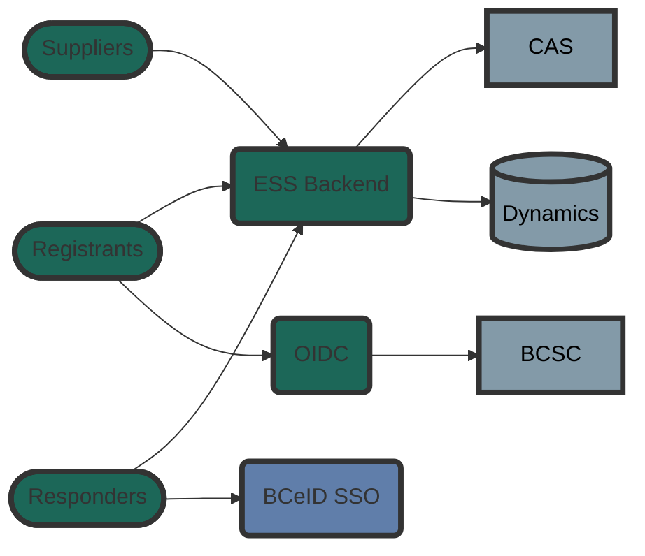

# Emergency Management BC - Evacuee Registration and Assistance (ERA)

A system to manage evacuees registrations and support provisioning for residents of the province of British Columbia

## Getting Help or Reporting an Issue

To report bugs/issues/feature requests, please email us at essmodernization@gov.bc.ca

## How to Contribute

If you would like to contribute, please see our [Contributing](./CONTRIBUTING.md) guidelines.

Please note that this project is released with a [Contributor Code of Conduct](./CODE_OF_CONDUCT.md). By participating in this project you agree to abide by its terms.

## Architecture

## Components

| Directory                       | Role               |
| ------------------------------- | ------------------ |
| [ess](./ess/)                   | backend service    |
| [suppliers](./suppliers/)       | suppliers portal   |
| [registrants](./registrants/)   | registrants portal |
| [responders](./responders/)     | responders portal  |
| [landing-page](./landing-page/) | ESS landing page   |
| [oauth-server](./oauth-server/) | Oauth/OIDC service |
| [shared](./shared/)             | shared libraries   |

## Tests

| Directory                             | Role                                 |
| ------------------------------------- | ------------------------------------ |
| [automated-tests](./automated-tests/) | automated UI tests based on SpecFlow |
| [load-test](./load-test/)             | load test generator based on K9      |

## License

    Copyright 2022 Province of British Columbia

    Licensed under the Apache License, Version 2.0 (the "License");
    you may not use this file except in compliance with the License.
    You may obtain a copy of the License at 

       http://www.apache.org/licenses/LICENSE-2.0

    Unless required by applicable law or agreed to in writing, software
    distributed under the License is distributed on an "AS IS" BASIS,
    WITHOUT WARRANTIES OR CONDITIONS OF ANY KIND, either express or implied.
    See the License for the specific language governing permissions and
    limitations under the License.
   