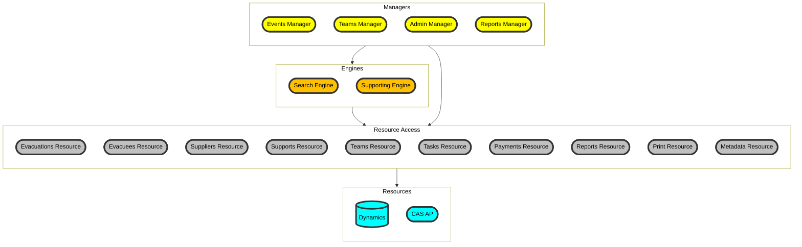

# EMBC ESS Back-end Services

Back-end service to provide data and business logic to ESS portals

## Features

- gRPC service to send and receive data from Dynamics
- business logic layer and mappings
- active background tasks to populate cache and perform timed actions
- connect to external services



## Project status

[](https://github.com/bcgov/embc-ess-mod/actions/workflows/ci-ess-backend.yml)

## Installation

API Env vars:
```s
APP_NAME=dev-ess-backend
ASPNETCORE_ENVIRONMENT=development
Dynamics__ADFS__OAuth2TokenEndpoint=<ADFS token endpoint>
Dynamics__DynamicsApiEndpoint=<Dynamics url>
Dynamics__DynamicsApiBaseUri=<Dynamics base url>/api/data/v9.0/
notifications__email__smtpserver=apps.smtp.gov.bc.ca
notifications__email__subjectprefix=DEV - 
REGISTRANTS_PORTAL_BASE_URL=http://localhost:5200
messaging__authorizationEnabled=true
messaging__oauth__metadataAddress=https://era-oauth-dev.apps.silver.devops.gov.bc.ca/.well-known/openid-configuration
cas__baseUrl=<CAS base url>
backgroundtask__PaymentReconciliationBackgroundTask__enabled=false
backgroundtask__PendingPaymentsProcessingBackgroundTask__enabled=false
backgroundtask__ApprovedSupportsProcessingBackgroundTask__enabled=false
backgroundtask__PendingSupportsProcessingBackgroundTask__enabled=true
```

API secret env vars:

```s
Dynamics__ADFS__ClientId=<ADFS client id>
Dynamics__ADFS__ClientSecret=<ADFS client secret>
Dynamics__ADFS__ResourceName=<ADFS Dynamics resource name>
Dynamics__ADFS__serviceAccountDomain=<Dynamics service account user domain>
Dynamics__ADFS__serviceAccountName=<Dynamics service account user name>
Dynamics__ADFS__serviceAccountPassword=<Dynamics service account password>
REDIS_CONNECTIONSTRING=<optional redis connection string>
SPLUNK_URL=<optional Splunk collector url>
SPLUNK_TOKEN=<optional Splunk token>
cas__clientId=<CAS client id>
cas__clientSecret=-<CAS client secret>
```
### Dynamics OData code generation

#### prerequisites

-  [OData Connected Services extension for VS2022](https://github.com/odata/ODataConnectedService)
- Access to ERA Dynamics instance

**Steps to update Dynamics Connected Service**
1. Open `ess/src/API/EMBC.ESS.sln` in Visual Studio
2. run `EMBC.Tests.Integration.ESS.DynamicsBaseTests.GetSecurityToken` integration test
3. copy the Authorization header from the test output log (e.g. `Authorization: Bearer abcdefg...`)
4. right-click Connected Services/Dynamics folder and select `Update OData Connected Service`
5. paste the Authorization header into Custom Header and click next
6. if authentication is successful, the next screen will show the list of entities in Dynamics
7. Finish the update wizard to complete the generated code refresh
8. compile and run the integration tests suite to verify Dynamics integration functionality is not broken

## Usage

1. set the above env vars in the API project's secrets.json file
2. in `ess/src/API/EMBC.ESS.Host`, run `dotnet watch`

This project has an extensive suit of integration tests, to run them, ensure you're on the gov network and have access to Dynamics first, then using VS, run all the tests.