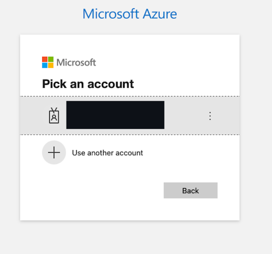

# Checking IDIR (Entra ID) Status of Linked GitHub Users

This folder contains a set of scripts for cross-referencing GitHub IDs within an organization and linked Entra ID users. The purpose is to identify (or remove) users who are active GitHub organization members and were Entra ID tenant members at one point, but may not be current members. For example, their Entra ID account has expired and/or they are no longer employees of the organizations whose tenant hosts the Entra ID directory that they linked against. 

## Prerequisites

- A MacOS or Linux (Windows + WSL2) system with `zsh` (tested only on MacOS).
- A python 3+ environment
- `gh` command line tool
- `jq` command line tool
- An Entra ID within the target Azure tenancy
- A GitHub ID with owner permissions on the organization you're checking users against
- A GitHub personal access token with `admin:org` permission

## How to use

A single script can be used to generate a list of email addresses for GitHub users who have linked an SSO identity. The steps below describe the pre-requisites/setup for running the script.

### Set up

- create and activate a python [virtual environment](https://docs.python.org/3/library/venv.html) (recommended)
```shell
python -m venv /path/to/new/virtual/environment
```
- install python dependencies
```shell
pip install -r requirements.txt
```

Once you've completed the steps above, you're ready to run the main script.

### Running the main script `check_users.sh`

`check_users.sh` is a shell script that makes use of the `gh` command line tool as well as `jq`, python, and general command line functionality. 

Running the script is done as shown below.

```shell
GITHUB_TOKEN=<YOUR_TOKEN> ./check_users.sh <ORG_NAME> <-r|--remove> 
```

> When running the script, <YOUR_TOKEN> should be replaced with a GitHub personal access token with `admin:org` scope,  <ORG_NAME> should be replaced with the name of the GitHub organization you're working with. The `-r` or `--remove` flag is optional, and if included, will remove the users from the GitHub organization if there is no corresponding Entra ID account found.

When the script runs, you'll be prompted in a web browser to login into Entra ID with a screen similar to the one below. This is required in order to call the Microsoft Graph API to retrieve details about Entra ID users. This prompt will show each time the script is run.



The script takes a few moments to run and may not show any output, but give it some time, as it will only produce output for GitHub IDs with no active corresponding Entra ID. It will also produce output for Github IDs that have SSO identities that aren't email addresses, or where the SSO identity is empty. There may not be many (or any) users that meet these criteria. 

Output is in CSV format, with the layout shown below (sample data generated by [GenerateData.com](https://generatedata.com/generator) ), and can easily be processed further or redirected to a flat CSV file.

- Case where there is no Entra ID account for a given GitHub SSO identity:

```csv
date, org, sso_identity, github_id, active_idr, removed_from_org, intentionally_left_blank, error_message
16-04-2025, bcgov-c, commodo.tincidunt.nibh@gmail.com, BlueBalloon2721, False, True,,
```

- Case where the SSO identify from GitHub is not an email address and, therefore, cannot be used to identify the user in Entra ID: 

```csv
date, org, sso_identity, github_id, active_idr, removed_from_org, intentionally_left_blank, error_message
16-04-2025, bcgov-c, 0hQ6YvEggALyQl-WqV8t3N9WY9MbpzXT7tdjxmQq5p0, CrazyKitten2078, False, False,,Unexpected NameID format.
```

- Case where the SSO identity from GitHub is empty, and therefore cannot be used to identify the user in Entra ID:

```csv
date, org, sso_identity, github_id, active_idr, removed_from_org, intentionally_left_blank, error_message
16-04-2025, bcgov-c, NO EMAIL??!!, jsykim, False, False,,NameID is empty.
```

#### Notes

1. Information abbout users' SSO identitites is not readily available via the GitHub REST API, but it is available using the GitHub graphQL API. This, and the fact that it was slightly easier to call the graphQL API from `gh` than python is the reason that both are used, vs. having all data retrieval happen within the python script. This could be revisited at some point to simplify things.

2. If other data elements besides the SSO-associated email address are needed, the scripts could easily be modified accordingly, or copied and adapted for other purposes without much effort. 


