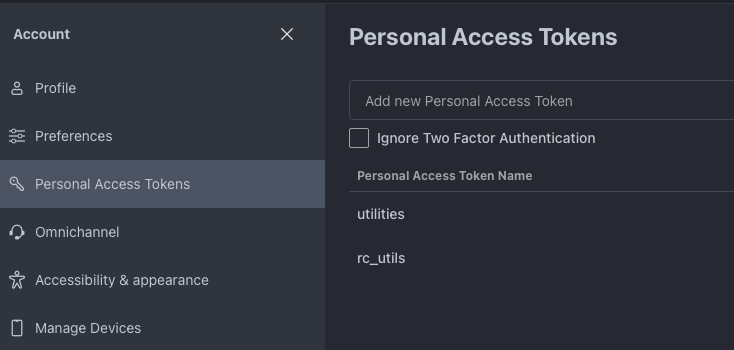

## What's here?

This directory currently contains a python-based utility script and a shell script to export users from Rocket.Chat using its API.

## How do I use this stuff?

### export_users.py

You can run [`export_users.sh`](export_users.py) directly, provided that you have python3 installed, installed dependencies using `pip` or equivalent, AND you've defined the `RC_USER_ID` and `RC_AUTH_TOKEN` environment variables containing your Rocket.Chat personal access token value. You can create these from the "Account" -> "Personal Access Tokens" menu in Rocket.Chat (see screen shot below).



You can run the script as shown below.

```shell
pip install -r requirements.txt
RC_USER_ID="RC_USER_ID" RC_AUTH_TOKEN="123xyz" python export_users.py
```

This will output the results in JSON to the standard output. If you want this in another format, you can use `jq`, as is done in [`export_users_to_csv.sh`](export_users_to_csv.sh).

### export_users_to_csv.sh

This is a wrapper around the above-mentioned python script that does two extra things:

1. defines the required environment variables from a credentials vault (local 1password in this case)
1. formats the output using `jq` and writes to a file called `rocketchat_users.csv

To run this, you'll need to install `jq` using a suitable tool for your platform, as well as installing the python requirements. You'll also need to update the script to access the credentials, since everyone won't have an identical vault tool, credential names, etc. Once you've done this, the script is run as below.

```shell
./expoert_users_to_csv.sh
```

